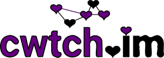

# [Tor](../index.html.en)

  * [Home](../index.html.en)
  * [About Tor](../about/overview.html.en)
  * [Documentation](../docs/documentation.html.en)
  * [Press](../press/press.html.en)
  * [Blog](https://blog.torproject.org/blog/)
  * [Newsletter](https://newsletter.torproject.org)
  * [Contact](../about/contact.html.en)

  * [Download](../download/download-easy.html.en)
  * [Volunteer](../getinvolved/volunteer.html.en)
  * [Donate](../donate/donate-button.html.en)

[Home » ](../index.html.en) [Projects Overview »
](../projects/projects.html.en) [Community](../projects/community.html.en)

# Tor Community Projects

The Tor community of software and services aims to make your Internet
experience safer and better.

[Onionshare](https://onionshare.org)

OnionShare is an open source tool that lets you securely and anonymously share
a file of any size.

[SecureDrop](https://securedrop.org/)

SecureDrop ([secrdrop5wyphb5x.onion](http://secrdrop5wyphb5x.onion)) is an
open source whistleblower submission system that media organizations can
install to securely accept documents from anonymous sources. It was originally
coded by the late Aaron Swartz and is now managed by [Freedom of the Press
Foundation](https://freedom.press/).

[Globalleaks](https://www.globaleaks.org/)

GlobaLeaks is an open-source, free software intended to enable secure and
anonymous whistleblowing initiatives. The software is developed by the [Hermes
Center for Transparency and Digital Human
Rights](https://www.hermescenter.org/).

[ChatSecure](https://chatsecure.org/)

ChatSecure is a messaging application for iOS which allows OTR and OMEMO
encryption for the XMPP protocol. ChatSecure is free and open source software
available under the GNU General Public License. ChatSecure also features
built-in support for anonymous communication on the Tor network.

[Cwtch](https://cwtch.im/)

Cwtch is an extension of the metadata resistant protocol Ricochet to support
asynchronous, multi-peer group communications through the use of discardable,
untrusted, anonymous infrastructure.

**Warning:** Cwtch is an experimental prototype. Please do not use it for
anything where security, privacy, or anonymity is critical.

[Ricochet](https://Ricochet.im)

Ricochet IM is an open-source, decentralized instant messenger project that
utilities the Tor network by design. It starts a Tor onion service on the
users local system and facilitates communication with other Ricochet users who
are also running their own Ricochet-created Tor onion service, providing End-
to-End encryption by never allowing the connection to leave the Tor network.

**Warning:** On some operating systems, Ricochet ships with Tor 0.2.8.9. Tor
0.2.8.9 has several known onion service security issues, including
TROVE-2016-12-002 and later. Tor 0.2.8 has not been supported since 1 January
2018. Please update to a supported tor version before launching Ricochet.
Development stalled in November 2016, though it has been relatively stable in
the time since.

See also our wiki page [ Torify HOWTO / Instant
Messaging](https://trac.torproject.org/projects/tor/wiki/doc/TorifyHOWTO/InstantMessaging)

[Ahmia - Onion Service Search](https://ahmia.fi/)

Ahmia ([msydqstlz2kzerdg.onion](http://msydqstlz2kzerdg.onion/)) is open-
source search engine software that indexes, searches, and catalogs content
published on Tor Onion Services. Furthermore, it is an environment to share
meaningful insights, statistics, insights, and news about the Tor network
itself. In this context, there is a lot of work to do.

The Ahmia web service is written using the Django web framework. As a result,
the server-side language is Python. On the client-side, most of the pages are
plain HTML. There are some pages that require JavaScript, but the search
itself works without client-side JavaScript.

[Orchid](https://github.com/mhatta/Orchid)

Orchid is a Tor client implementation and library written in pure Java. Orchid
runs on Java 5+ and the Android devices. It can be used to Tor-ify Java and
JVM applications with near transparency. In a basic use case, running Orchid
will open a SOCKS5 listener which can be used as a standalone client where Tor
would otherwise be used.

See our list of [ other Tor
implementations](http://trac.torproject.org/projects/tor/wiki/doc/ListOfTorImplementations)

[HTTPS Everywhere](https://www.eff.org/https-everywhere)

HTTPS Everywhere is a Firefox and Chrome extension that encrypts your
communications with many major websites, making your browsing more secure.

[NoScript](https://noscript.net)

NoScript allows JavaScript, Flash (and other plugins) only for trusted domains
of your choice (e.g. your home-banking web site). This whitelist based pre-
emptive blocking approach prevents exploitation of security vulnerabilities
(known and even unknown).

[bine](https://github.com/cretz/bine)

bine is a [Tor controller](https://stem.torproject.org/faq.html#are-there-any-
other-controller-libraries) written in Go. Its README has an example config to
set up an onion service.

[carml](https://meejah.ca/projects/carml)

carml is a command-line collection of utilities to query and manipulate a
running Tor. It does terminal colours, plays nicely with grep, pipes and so
forth and is easily extensible.

[Whonix](https://www.whonix.org/)

Whonix is a Debian GNU/Linux based security-focused Linux distribution. It
aims to provide privacy, security and anonymity on the internet. The operating
system consists of two virtual machines, a "Workstation" and a Tor "Gateway",
running Debian GNU/Linux. All communications are forced through the Tor
network to accomplish this.

[OnionBalance](https://onionbalance.readthedocs.io/en/latest/)

OnionBalance provides load-balancing and redundancy for Tor hidden services by
distributing requests to multiple backend Tor instances.
[source](https://github.com/DonnchaC/onionbalance)

As of September 2018 support for [ Next-Generation Onion
Services](http://trac.torproject.org/projects/tor/wiki/doc/NextGenOnions) was
[in development](https://github.com/DonnchaC/onionbalance/issues/69).

# Deprecated Community Projects

Following projects have been useful in the past but are no longer maintained
and may have security issues.  
They can still be interesting for developers.

[Tor-ramdisk](https://en.wikipedia.org/wiki/Tor-ramdisk)

Tor-ramdisk is an i686 uClibc-based micro Linux distribution whose only
purpose is to host a Tor server in an environment that maximizes security and
privacy. Tor is a network of virtual tunnels that allows people and groups to
improve their privacy and security on the Internet. Security is enhanced in
Tor-ramdisk by employing a monolithically compiled GRSEC/PaX patched kernel
and hardened system tools.

[Roster](https://github.com/seansaito/Roster)

Roster is a Tor project that awards points and badges to relay operators based
on the performance of their families

[OnionTip](https://github.com/DonnchaC/oniontip)

OnionTip is a web app which parses Tor relay data to allow users to tip
volunteers for running relay in a fair and open way. https://oniontip.com

[Cupcake](https://github.com/glamrock/cupcake)

Cupcake Bridge helps users making bridges automagically with a browser
extension for Chrome and Firefox

  * [Software & Services](../projects/projects.html.en)

## Tor Tip

Tor is written for and supported by people like you. [Donate
today](../donate/donate.html.en)!

Trademark, copyright notices, and rules for use by third parties can be found
[in our FAQ](../docs/trademark-faq.html.en).

We offer an [onion service](https://www.torproject.org/docs/hidden-services)
for this site: [expyuzz4wqqyqhjn.onion/](http://expyuzz4wqqyqhjn.onion/).  
See <https://onion.torproject.org> for all torproject.org onion addresses.

#### About Tor

  * [What Tor Does](../about/overview.html.en)
  * [Users of Tor](../about/torusers.html.en)
  * [Core Tor People](../about/corepeople.html.en)
  * [Sponsors](../about/sponsors.html.en)
  * [Contact Us](../about/contact.html.en)

#### Get Involved

  * [Donate](../donate/donate-foot.html.en)
  * [Mailing Lists](../docs/documentation.html.en#MailingLists)
  * [Onion Services](../docs/onion-services.html.en)
  * [Translations](../getinvolved/translation.html.en)

#### Documentation

  * [Manuals](../docs/tor-manual.html.en)
  * [Installation Guides](../docs/documentation.html.en)
  * [Tor Wiki](https://trac.torproject.org/projects/tor/wiki/)
  * [General Tor FAQ](../docs/faq.html.en)

